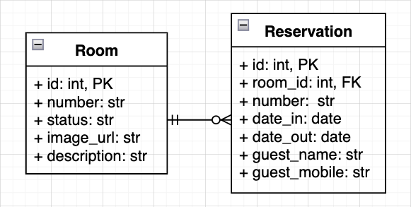
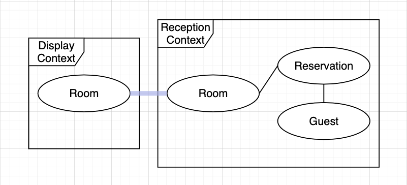

# Python Domain-Driven-Design(DDD) Example

## Intro
I've adopted the DDD pattern for my recent FastAPI project.
DDD makes it easier to implement complex domain problems.
Improved readability and easy code correction have significantly improved productivity.
As a result, stable project management has become possible.
I'm very satisfied with it, so I'd like to share this experience and knowledge.

### Why DDD?
Using DDD makes it easy to maintain collaboration with domain experts, not only engineers.
- It is possible to prevent the mental model and the actual software from being dualized.
- Business logic is easy to manage.
- Infrastructure change is flexible.


### Objective
- Let's create a simple hotel reservation system and see how each component of DDD is implemented.
- Don't go too deep into topics like event sourcing.
- Considering the running curve, this project consists only of essential DDD components.

### Requirements
- Python 3.10+

## Implementation
### ERD
> NOTES: The diagram below represents only the database tables.



### Bounded Context



- Display(Handling tasks related to the hotel room display)
  - List Rooms
- Reception(Handling tasks related to the hotel room reservation)
  - Make a reservation
  - Change the reservation details
  - Cancel a reservation
  - Check-in & Check-out

Check-in & check-out domains can also be isolated, but let's say that reception handles it together for now.

### Project Structure
```tree
src
├── bounded_context
│   ├── display
│   │   ├── application
│   │   │   ├── dto
│   │   │   ├── exception
│   │   │   └── service
│   │   ├── domain
│   │   │   ├── entity
│   │   │   └── value_object
│   │   ├── infra
│   │   │   ├── repository
│   │   │   └── external_apis
│   │   └── presentation
│   │       ├── grpc
│   │       └── rest
│   ├── reception
│   │   ├── application
│   │   ├── domain
│   │   ├── infra
│   │   └── presentation
│   └── shared_kernel
└── ddd_hotel
    ├── database
    │   ├── connection
    │   ├── orm
    │   └── repository
    ├── fastapi
    │   ├── config
    │   └── main.py 
    └── log
```

### DDD Components
#### 1. Entity: Definition
```python
from dataclasses import dataclass, field


class Entity:
    id: int = field(init=False)
  
    def __eq__(self, other: Any) -> bool:
        if isinstance(other, type(self)):
            return self.id == other.id
        return False
  
    def __hash__(self):
        return hash(self.id)


class AggregateRoot(Entity):
    pass


@dataclass(eq=False, slots=True)
class Reservation(AggregateRoot):
    room: Room
    reservation_number: ReservationNumber
    status: ReservationStatus
    date_in: datetime
    date_out: datetime
    guest: Guest
    
    _number: str = field(init=False)
    _status: str = field(init=False)
    _guest_name: str = field(init=False)
    _guest_mobile: Optional[str] = field(init=False)
```

- Entity mix-in <br>
The entity is an object that have a distinct identity.
I will implement `__eq__()` and `__hash__()`, to use it as a mix-in for dataclass.

- AggregateRoot mix-in <br>
A DDD aggregate is a cluster of domain objects that can be treated as a single unit.
An aggregate root is an entry point of an aggregate.
Any references from outside the aggregate should only go to the aggregate root. 
The root can thus ensure the integrity of the aggregate as a whole. 
I will define an empty class called `AggregateRoot` and explicitly mark it.

- Entity Implementation <br>
To use `__eq__()` from `Entity` mix-in, add `eq=False`.
From Python 3.10, `slots=True` makes dataclass more memory-efficient.

- Value Object <br>
With sqlalchemy, you can define the value objects within entity when reading data from a repository.
I will introduce the details later.

#### 2. Entity: Life Cycle

```python
@dataclass(eq=False, slots=True)
class Reservation(AggregateRoot):
    # ...

    @classmethod
    def make(cls, room: Room, date_in: datetime, date_out: datetime, guest: Guest) -> Reservation:
        room.reserve()
        return cls(
            room=room,
            date_in=date_in,
            date_out=date_out,
            guest=guest,
            reservation_number=ReservationNumber.generate(),
            status=ReservationStatus.IN_PROGRESS,
        )

    def cancel(self):
        if not self.status.in_progress():
            raise ReservationStatusError
  
        self.status = ReservationStatus.CANCELLED
  
    def check_in(self):
        # ...
  
    def check_out(self):
        # ...
  
    def change_guest(self, guest: Guest):
        # ...
```

By implementing the method according to the entity's life cycle, you can expect how it evolves when reading it.

- Creation <br>
Declare a `class method` and use it when creating an entity.

- Changes <br>
Declare an `instance method` and use it when changing an entity.

#### 3. Entity: Table Mapping
> NOTE: This is the most beautiful part of implementing DDD with sqlalchemy.
- [ddd_hotel/database/orm.py](src/ddd_hotel/database/orm.py)

```python
from sqlalchemy import MetaData, Table, Column, Integer, String, Text, ForeignKey, DateTime
from sqlalchemy.orm import registry

metadata = MetaData()
mapper_registry = registry()

room_table = Table(
    "hotel_room",
    metadata,
    Column("id", Integer, primary_key=True, autoincrement=True),
    Column("number", String(20), nullable=False),
    Column("status", String(20), nullable=False),
    Column("image_url", String(200), nullable=False),
    Column("description", Text, nullable=True),
)

reservation_table = Table(
    "room_reservation",
    metadata,
    Column("id", Integer, primary_key=True, autoincrement=True),
    Column("room_id", Integer, ForeignKey("hotel_room.id"), nullable=False),
    Column("number", String(20), nullable=False),
    Column("status", String(20), nullable=False),
    Column("date_in", DateTime(timezone=True)),
    Column("date_out", DateTime(timezone=True)),
    Column("guest_mobile", String(20), nullable=False),
    Column("guest_name", String(50), nullable=True),
)


def init_orm_mappers():
    from bounded_context.reception.domain.entity.room import Room as ReceptionRoomEntity
    from bounded_context.reception.domain.entity.reservation import Reservation as ReceptionReservationEntity
  
    mapper_registry.map_imperatively(
        ReceptionRoomEntity,
        room_table,
        properties={
          "_status": room_table.c.status,
          "status": composite(RoomStatus.from_value, room_table.c.status),
        }
    )
    mapper_registry.map_imperatively(
        ReceptionReservationEntity,
        reservation_table,
        properties={
          "_number": reservation_table.c.number,
          "_status": reservation_table.c.status,
          "_guest_mobile": reservation_table.c.guest_mobile,
          "_guest_name": reservation_table.c.guest_name,
          "room": relationship(Room, backref="reservations", order_by=reservation_table.c.id.desc),
          "reservation_number": composite(ReservationNumber.from_value, reservation_table.c.number),
          "status": composite(ReservationStatus.from_value, reservation_table.c.status),
          "guest": composite(Guest, reservation_table.c.guest_mobile, reservation_table.c.guest_name),
        }
    )

    from bounded_context.display.domain.entity.room import Room as DisplayRoomEntity
    
    mapper_registry.map_imperatively(
      DisplayRoomEntity,
      room_table,
      properties={
        "_status": room_table.c.status,
        "status": composite(RoomStatus.from_value, room_table.c.status),
      }
    )
    
```

```python
# call this after app running
init_orm_mappers()
```

Because entities do not need to know the implementation of the database table, let's use sqlalchemy's [imperative mapping](https://docs.sqlalchemy.org/en/14/orm/mapping_styles.html#imperative-mapping) to separate entity definitions and table definitions.

```python
# src/bounded_context/reservation/...
@dataclass(eq=False)
class Room(Entity):
    number: str
    status: Optional[RoomStatus]
  
    _status: str = field(init=False)
```

Entities only need to use logically required data among the columns defined in the table.
For example, in the `reservation` domain, you don't need to know the `image` of the `room`, so only `name`, `status` is defined in the `room`.

#### 4. Value Object
```python
from pydantic import constr


mobile_type = constr(regex=r"\+[0-9]{2,3}-[0-9]{2}-[0-9]{4}-[0-9]{4}")

@dataclass(slots=True)
class Guest(ValueObject):
    mobile: mobile_type
    name: Optional[str] = None
```

The value object is an object that matter only as the combination of their attributes.
Guest A's name and mobile should be treated as a single unit, so make it a value object.

Using sqlalchemy's [composite column type](https://docs.sqlalchemy.org/en/14/orm/composites.html#composite-column-types), it allows you to implement value objects by changing columns to an object that fits your needs when you load data.

Let's define the mix-in as follows and inherit it when implementing a value object.

```python
class ValueObject:
    def __composite_values__(self):
        return self.value,
  
    @classmethod
    def from_value(cls, value: Any) -> Optional[ValueObjectType]:
        if isinstance(cls, EnumMeta):
            for item in cls:
                if item.value == value:
                    return item
            return None
        else:
            return cls(value=value)
```

If you define the `__composite_values_()` method, sqlalchemy separates the objects and puts them in the columns when you save the data.

> NOTE: The , in the return of `__composite_value__()` is not a typo.

```python
class RoomStatus(ValueObject, str, Enum):
    AVAILABLE = "AVAILABLE"
    RESERVED = "RESERVED"
    OCCUPIED = "OCCUPIED"

    def is_available(self) -> bool:
        return self == RoomStatus.AVAILABLE

@dataclass(slots=True)
class ReservationNumber(ValueObject):
    DATETIME_FORMAT: ClassVar[str] = "%y%m%d%H%M%S"
    RANDOM_STR_LENGTH: ClassVar[int] = 7
  
    value: str

    @classmethod
    def generate(cls) -> ReservationNumber:
        time_part: str = datetime.utcnow().strftime(cls.DATETIME_FORMAT)
        random_strings: str = ''.join(
          random.choice(string.ascii_uppercase + string.digits) for _ in range(cls.RANDOM_STR_LENGTH)
        )
        return cls(value=time_part + ":" + random_strings)
```

`ReservationNumber` intentionally used the name `value` when adding an attribute to leverage `_composite_values_()` in `ValueObject` class.

```python
@dataclass(slots=True)
class Guest(ValueObject):
    mobile: mobile_type
    name: Optional[str] = None

    def __composite_values__(self):
        return self.mobile, self.name
```

If a value object consists of more than one column, you must override the `__composite_values__()` as shown above.

#### Dependency Injection
FastAPI's `Depends` makes it easy to implement `Dependency Injection` between different layers.

- [presentation/rest/reception.py](src/bounded_context/reception/presentation/rest/reception.py)
```python
@router.get("/reservations/{reservation_number}")
def get_reservation(
    reservation_number: str,
    reservation_query: ReservationQueryUseCase = Depends(ReservationQueryUseCase),
):
    try:
        reservation: Reservation = reservation_query.get_reservation(reservation_number=reservation_number)
    except ReservationNotFoundError as e:
        raise HTTPException(
            status_code=status.HTTP_404_NOT_FOUND,
            detail=e.message,
        )
    return ReservationResponse(
        detail="ok",
        result=ReservationDTO.build_result(reservation=reservation),
    )
```

- [application/use_case/query.py](src/bounded_context/reception/application/use_case/query.py)
```python
class ReservationQueryUseCase:
    def __init__(
        self,
        reservation_repo: ReservationRDBRepository = Depends(ReservationRDBRepository),
    ):
        self.reservation_repo = reservation_repo

    def get_reservation(self, reservation_number: str) -> Reservation:
        reservation_number = ReservationNumber.from_value(reservation_number)

        reservation: Optional[Reservation] = (
            self.reservation_repo.get_reservation_by_reservation_number(reservation_number=reservation_number)
        )

        if not reservation:
            raise ReservationNotFoundError

        return reservation
```

- [infra/repository/repository.py](src/bounded_context/reception/infra/repository.py)
```python
class ReservationRDBRepository(RDBRepository):
    def get_reservation_by_reservation_number(self, reservation_number: ReservationNumber) -> Optional[Reservation]:
        return self.session.query(Reservation).filter_by(reservation_number=reservation_number).first()
```

#### DTO(Data Transfer Object)
Pydantic makes it easy to implement the DTO used for request and response.
- [application/dto/request.py](src/bounded_context/reception/application/dto/request.py)
```python
class CreateReservationRequest(BaseModel):
    room_number: str
    date_in: datetime
    date_out: datetime
    guest_mobile: mobile_type
    guest_name: str | None = None
```

- [application/dto/response.py](src/bounded_context/reception/application/dto/response.py)
```python
class ReservationDTO(BaseModel):
    room: RoomDTO
    reservation_number: str
    status: ReservationStatus
    date_in: datetime
    date_out: datetime
    guest: GuestDTO

    @classmethod
    def build_result(cls, reservation: Reservation) -> ReservationDTO:
        return cls(
            room=RoomDTO.from_entity(reservation.room),
            reservation_number=reservation.reservation_number.value,
            status=reservation.status,
            date_in=reservation.date_in,
            date_out=reservation.date_out,
            guest=GuestDTO.from_entity(reservation.guest),
        )


class ReservationResponse(BaseResponse):
    result: ReservationDTO

```